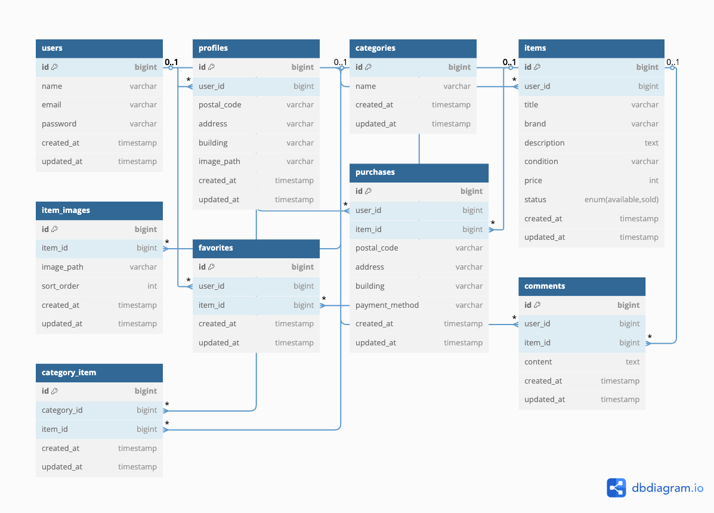

# 🛍 Laravel フリマアプリ

このアプリはフリーマーケットサービスです。  
ユーザーは商品を出品・購入・コメント・いいね（お気に入り）などが可能です。
---
## ✅ 主な機能

- ユーザー登録・ログイン（メール認証あり）
- 商品の出品・購入
- 商品一覧・検索
- 商品へのコメント投稿
- いいね（お気に入り）機能・マイリストへの登録
- Stripe決済（カード・コンビニ）
- 購入履歴・出品履歴の確認
- プロフィールの編集

---

## 🛠 環境構築手順
### 環境構築

Docker を使用して開発環境を構築しています。
docker-compose.ymlのnginx,mysqlにplatform: linux/amd64と記述しています。必要に応じて変更してください。

### 使用技術
- PHP 7.4.9 
- Laravel 8.83.29 
- MySQL 8.0.26 
- Laravvel Fortify
- MailHog
- Stripeアカウント（テストキー）

### セットアップ手順

#### 環境ファイルをコピー
cp .env.example .env

#### 依存関係をインストール
composer install
npm install && npm run dev

#### アプリケーションキーを生成
php artisan key:generate

#### データベースをマイグレート & シーディング
php artisan migrate --seed

---

## 📸 ER 図

データベース設計の概要：

