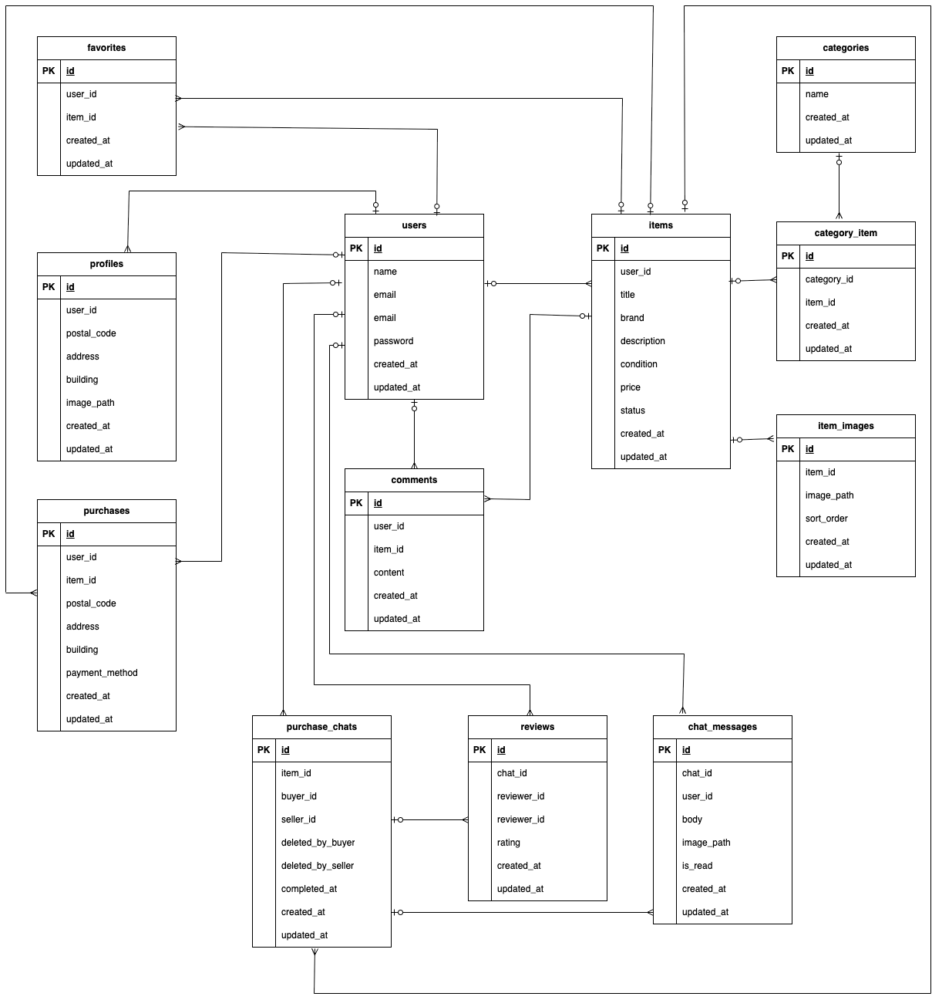

# 🛍 Laravel フリマアプリ

このアプリはフリーマーケットサービスです。  
ユーザーは商品を出品・購入・コメント・いいね（お気に入り）などが可能です。
---
## ✅ 主な機能

- ユーザー登録・ログイン（メール認証あり）
- 商品の出品・購入
- 商品一覧・検索
- 商品へのコメント投稿
- いいね（お気に入り）機能・マイリストへの登録
- Stripe決済（カード・コンビニ）
- 購入履歴・出品履歴の確認
- プロフィールの編集

---

## 🛠 環境構築手順
### 環境構築

Docker を使用して開発環境を構築しています。
docker-compose.ymlのnginx,mysqlにplatform: linux/amd64と記述しています。必要に応じて変更してください。

### 使用技術
- PHP 7.4.9 
- Laravel 8.83.29 
- MySQL 8.0.26 
- Laravvel Fortify
- MailHog
- Stripe（テストキー）

### セットアップ手順

#### ビルド＆起動
```
docker compose up -d --build
```

#### Laravelコンテナに入る
```
docker compose exec app bash
```

#### 依存関係をインストール
```
composer install
```

#### 環境ファイルをコピー
```
cp .env.example .env
```
```
DB_CONNECTION=mysql
DB_HOST=mysql
DB_PORT=3306
DB_DATABASE=laravel_db
DB_USERNAME=laravel_user
DB_PASSWORD=laravel_pass
```
#### アプリケーションキーを生成
```
php artisan key:generate
```
#### 画像表示用のシンボリックリンク作成
```
php artisan storage:link
```
#### データベースをマイグレート & シーディング
```
php artisan migrate --seed
```
---
## 💳 Stripe
#### 現在の仕様
- クレジットカードによる即時決済をサポート
- 決済完了は Stripe の success_url リダイレクトで判断
- Webhook未使用
#### Stripe APIキーの取得手順
1. [Stripe公式サイト](https://dashboard.stripe.com/register) にアクセスしてアカウントを作成します。
2. ダッシュボードの「開発者」>「APIキー」へ進みます。
3. 以下の2種類のキーを取得し、`.env` に記述します（**テストキーを使用してください**）：
    - 公開可能キー（例: `pk_test_...`）
    - シークレットキー（例: `sk_test_...`）
#### .env設定例
 ```
STRIPE_PUBLIC=pk_test_XXXXXXXXXXXXXXXXXXXXXXXX
STRIPE_SECRET=sk_test_XXXXXXXXXXXXXXXXXXXXXXXX
```
> ⚠️ 本番環境では `.env` の Stripe キーは厳重に管理し、GitHub 等に公開しないよう注意してください。
---
## 📧 メール認証設定（MailHog 使用）
#### 機能概要
- 新規ユーザー登録時にメールアドレス認証必須
- 認証完了後のみログイン可能
#### MailHogの起動
```
docker run -d -p 1025:1025 -p 8025:8025 mailhog/mailhog
```
- Web UI: http://localhost:8025
- SMTPポート: 1025
#### .env設定例
```
MAIL_MAILER=smtp
MAIL_HOST=host.docker.internal
MAIL_PORT=1025
MAIL_USERNAME=null
MAIL_PASSWORD=null
MAIL_ENCRYPTION=null
MAIL_FROM_ADDRESS="noreply@example.com"
MAIL_FROM_NAME="${APP_NAME}"
```
#### テスト手順
1.	ユーザー登録
2.	MailHog Web UI http://localhost:8025 でメールを確認（ない場合は『認証メールを再送する』をクリック）
4.	認証リンクをクリックして有効化
5.	ログインが可能に
---
## 🧪 テスト
#### 実行コマンド
```
php artisan test
```
#### 主なFeatureテストカバー範囲
-	ユーザー認証、ログイン・ログアウト機能
-	ユーザー情報取得、変更
-	商品の出品・購入処理、履歴の表示
-	コメント投稿
-	いいね機能、マイリストへの表示
-	商品の一覧表示、詳細表示、検索機能
-	各バリデーションメッセージの表示
 ---
## 📸 ER 図

データベース設計の概要：



---
##URL
開発環境：http://localhost

